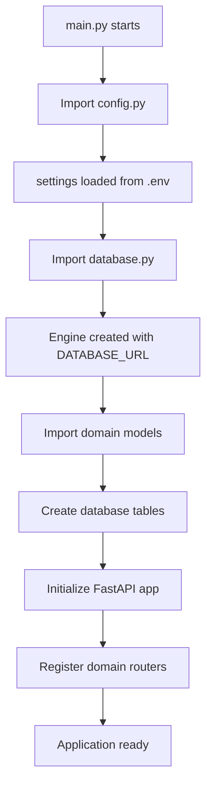

# PROJECT UNDERSTANDING

This document explains the core architecture and implementation details of our FastAPI API project, which follows Netflix Dispatch-inspired best practices.

## Table of Contents

- [Architecture Overview](#architecture-overview)
- [Core Files Analysis](#core-files-analysis)
  - [config.py - Configuration Management](#configpy---configuration-management)
  - [database.py - Database Layer](#databasepy---database-layer)
  - [main.py - Application Entry Point](#mainpy---application-entry-point)
- [How They Work Together](#how-they-work-together)
- [Best Practices Implemented](#best-practices-implemented)
- [Domain Structure](#domain-structure)

## Architecture Overview

Our project follows a **domain-driven architecture** with clear separation of concerns:

```
src/
├── config.py          # Global configuration management
├── database.py        # Database connection & ORM setup
├── main.py            # FastAPI application entry point
├── posts/             # Blog posts domain
└── partners/          # Partners domain
```

Each layer has specific responsibilities and follows the **single responsibility principle**.

## Core Files Analysis

### config.py - Configuration Management

```python
from pydantic_settings import BaseSettings
from enum import Enum

class Environment(str, Enum):
    DEVELOPMENT = "development"
    PRODUCTION = "production"
    TESTING = "testing"

class Config(BaseSettings):
    DATABASE_URL: str = "postgresql://blog_user:blog_pass@db:5432/blog_db"
    SECRET_KEY: str = "supersecretkey"

    ENVIRONMENT: Environment = Environment.DEVELOPMENT

    APP_VERSION: str = "1.0.0"
    APP_TITLE: str = "FastAPI Blog API"
    APP_DESCRIPTION: str = "A simple blog API with CRUD operations for posts and partners"

    # Database
    DB_ECHO: bool = False

    class Config:
        env_file = ".env"
        case_sensitive = True

settings = Config()
```

**Purpose**: Centralized configuration management using Pydantic Settings

**Key Features**:

- **Type Safety**: All settings are typed with proper validation
- **Environment-Based**: Uses `.env` file for environment-specific values
- **Enum for Environments**: Prevents typos and provides clear options
- **Singleton Pattern**: Single `settings` instance used throughout the app
- **Best Practice**: Follows pydantic-settings v2 pattern (separate from main pydantic)

**Configuration Categories**:

1. **Database**: Connection URL and behavior settings
2. **Security**: Secret keys for authentication/authorization
3. **Application**: Metadata for FastAPI app documentation
4. **Environment**: Development, production, testing modes

### database.py - Database Layer

```python
from sqlalchemy import create_engine, MetaData
from sqlalchemy.orm import sessionmaker, declarative_base
from src.config import settings

# Define naming convention for database constraints
POSTGRES_INDEXES_NAMING_CONVENTION = {
    "ix": "%(column_0_label)s_idx",
    "uq": "%(table_name)s_%(column_0_name)s_key",
    "ck": "%(table_name)s_%(constraint_name)s_check",
    "fk": "%(table_name)s_%(column_0_name)s_fkey",
    "pk": "%(table_name)s_pkey",
}

metadata = MetaData(naming_convention=POSTGRES_INDEXES_NAMING_CONVENTION)
Base = declarative_base(metadata=metadata)

# Create database engine
engine = create_engine(
    settings.DATABASE_URL,
    echo=settings.DB_ECHO
)

# Create SessionLocal class
SessionLocal = sessionmaker(autocommit=False, autoflush=False, bind=engine)

# Dependency to get database session
def get_db():
    db = SessionLocal()
    try:
        yield db
    finally:
        db.close()
```

**Purpose**: Database connection management and ORM configuration

**Key Components**:

1. **Naming Conventions**:

   - Standardizes database constraint names across all tables
   - Prevents naming conflicts and improves maintainability
   - Example: `posts_title_idx` for index, `posts_id_pkey` for primary key

2. **SQLAlchemy Setup**:

   - `Base`: Declarative base for all ORM models
   - `engine`: Database connection pool manager
   - `SessionLocal`: Session factory for database transactions

3. **Dependency Injection**:
   - `get_db()`: FastAPI dependency for database sessions
   - Ensures proper session lifecycle (create → use → close)
   - Automatic cleanup with try/finally pattern

**Best Practices Implemented**:

- ✅ Consistent naming conventions
- ✅ Proper session management
- ✅ Dependency injection pattern
- ✅ Configuration-driven setup

### main.py - Application Entry Point

```python
from fastapi import FastAPI
from src.config import settings
from src.database import engine
from src.posts.models import BlogPost  # Import to register with Base
from src.partners.models import Partner  # Import to register with Base
from src.database import Base
from src.posts.router import router as posts_router
from src.partners.router import router as partners_router

# Create database tables
Base.metadata.create_all(bind=engine)

app = FastAPI(
    title=settings.APP_TITLE,
    description=settings.APP_DESCRIPTION,
    version=settings.APP_VERSION
)

@app.get("/")
async def root():
    return {
        "message": "Welcome to FastAPI Blog API with Best Practices Structures",
        "status": "running",
        "version": settings.APP_VERSION
    }

# Include routers
app.include_router(posts_router, prefix="/posts", tags=["posts"])
app.include_router(partners_router, prefix="/partners", tags=["partners"])
```

**Purpose**: FastAPI application initialization and routing configuration

**Key Responsibilities**:

1. **Model Registration**:

   ```python
   from src.posts.models import BlogPost
   from src.partners.models import Partner
   ```

   - Imports ensure SQLAlchemy knows about all models
   - Required for `Base.metadata.create_all()` to work properly

2. **Database Initialization**:

   ```python
   Base.metadata.create_all(bind=engine)
   ```

   - Creates all tables on application startup
   - Safe to run multiple times (won't recreate existing tables)

3. **FastAPI Configuration**:

   ```python
   app = FastAPI(
       title=settings.APP_TITLE,
       description=settings.APP_DESCRIPTION,
       version=settings.APP_VERSION
   )
   ```

   - Uses centralized configuration from `settings`
   - Automatically generates OpenAPI documentation

4. **Router Registration**:
   ```python
   app.include_router(posts_router, prefix="/posts", tags=["posts"])
   app.include_router(partners_router, prefix="/partners", tags=["partners"])
   ```
   - Modular routing with domain-specific prefixes
   - Tags for organized API documentation

## How They Work Together

### 1. Application Startup Flow



### 2. Request Lifecycle

```mermaid
graph TD
    A[HTTP Request] --> B[FastAPI Router]
    B --> C[get_db() dependency]
    C --> D[Create DB Session]
    D --> E[Domain Service Logic]
    E --> F[Database Operations]
    F --> G[Close DB Session]
    G --> H[Return Response]
```

### 3. Configuration Flow

```
.env file → config.py → settings → database.py → main.py
```

## Best Practices Implemented

### 1. **Separation of Concerns**

- **config.py**: Only handles configuration
- **database.py**: Only handles database connectivity
- **main.py**: Only handles application initialization

### 2. **Dependency Injection**

```python
# In route handlers
async def create_post(post: PostCreate, db: Session = Depends(get_db)):
    return post_service.create_post(db, post)
```

### 3. **Type Safety**

- Pydantic models for configuration validation
- SQLAlchemy models with proper typing
- FastAPI automatic request/response validation

### 4. **Environment Management**

- `.env` file for environment-specific values
- Default values for development
- Type-safe environment enumeration

### 5. **Database Best Practices**

- Consistent naming conventions
- Proper session management
- Connection pooling via SQLAlchemy engine

### 6. **Documentation**

- Automatic OpenAPI generation
- Centralized app metadata
- Tagged endpoints for organization

## Domain Structure

Each domain (posts, partners) follows the same pattern:

```
posts/
├── __init__.py
├── router.py      # FastAPI endpoints
├── schemas.py     # Pydantic models (request/response)
├── models.py      # SQLAlchemy models (database)
└── service.py     # Business logic
```

**Benefits**:

- **Scalable**: Easy to add new domains
- **Maintainable**: Clear separation of concerns
- **Testable**: Each layer can be tested independently
- **Reusable**: Services can be used across different routes

## Key Takeaways

1. **Configuration Management**: Centralized, type-safe, environment-aware
2. **Database Layer**: Proper ORM setup with naming conventions and session management
3. **Application Structure**: Modular, domain-driven architecture
4. **Best Practices**: Following industry standards from Netflix Dispatch pattern
5. **Maintainability**: Clear separation makes the codebase easy to understand and modify

This architecture provides a solid foundation for building scalable FastAPI applications that can grow from simple APIs to complex microservices.
